# 👨‍💻 Thiago Alves

### Desenvolvedor em formação • Infraestrutura de TI • Redes

💻 HTML • CSS • JavaScript • Python  
🌐 Redes • Infraestrutura • Suporte • Telecomunicações

 

---

## 🚀 Sobre mim

Sou profissional de **Tecnologia da Informação**, com mais de **10 anos de experiência em tecnologia e atendimento ao público**.

Minha trajetória profissional é principalmente voltada para **Infraestrutura de TI, Redes de Computadores, Suporte Técnico, Servidores, Telecomunicações e atendimento a usuários**.

Atualmente estou ampliando minha atuação para o **desenvolvimento de software**, estudando e desenvolvendo projetos utilizando principalmente **HTML, CSS e JavaScript**, além de possuir conhecimentos básicos em **Python**.

Meu objetivo é unir minha experiência em infraestrutura com desenvolvimento, criando soluções cada vez mais completas e entendendo não apenas o software, mas também o ambiente onde ele é executado.

---

# 💻 Desenvolvimento

Atualmente meus principais estudos e projetos estão concentrados em:

### 🌐 Desenvolvimento Web

- **HTML5** — estruturação de páginas e aplicações Web
- **CSS3** — estilização, layouts e interfaces responsivas
- **JavaScript** — lógica, interatividade e funcionalidades
- Desenvolvimento de interfaces responsivas
- Manipulação do DOM
- Lógica de programação
- Algoritmos
- Consumo e manipulação de dados
- Estudos de APIs
- Desenvolvimento de projetos próprios

### 🐍 Python

Possuo **conhecimento básico em Python** e atualmente utilizo a linguagem principalmente para estudos de:

- Lógica de programação
- Algoritmos
- Estruturas condicionais
- Estruturas de repetição
- Funções
- Manipulação de dados
- Scripts e automação

---

# 🌐 Infraestrutura & Redes

Minha experiência profissional também inclui atuação prática em ambientes de infraestrutura de TI.

### 🔧 Experiência e conhecimentos

- 🖧 Administração e manutenção de redes
- 🌐 TCP/IP
- 🔌 Cabeamento estruturado
- 📡 Redes Wi-Fi
- 🛜 Configuração de equipamentos de rede
- 🖥️ Suporte técnico a usuários
- 🗄️ Servidores
- 📁 File Server
- 📞 VoIP
- 💾 Backup
- 🖨️ Impressoras e periféricos
- 🔐 Segurança da informação
- 📊 Monitoramento
- 🧰 Troubleshooting
- 🏢 Planejamento e implantação de infraestrutura de TI

### 📡 Tecnologias de infraestrutura

**Cisco • MikroTik • Ubiquiti/UniFi • Redes corporativas • Wi-Fi • Cabeamento estruturado • Servidores • VoIP**

Também possuo conhecimentos relacionados à **Cisco CCNA**.

---

# 🗄️ Banco de Dados

Durante meus estudos também venho trabalhando com bancos de dados relacionais e NoSQL.

### 📚 Estudos

- SQL
- MySQL
- CRUD
- Consultas
- Views
- Triggers
- MongoDB
- Estruturas de dados

---

# 🧰 Tecnologias & Ferramentas

### 💻 Desenvolvimento

### 🗄️ Banco de Dados

### 🌐 Infraestrutura

### 🛠️ Ferramentas

---

# 🎓 Formação

🎓 **Tecnólogo em Redes de Computadores**  
📚 Em andamento

💻 **Técnico em Desenvolvimento de Software**  
📚 Em andamento

🏅 **Cisco CCNA**

---

# 📊 GitHub Stats

---

# 🔥 GitHub Streak

---

# 📈 Atividade no GitHub

---

# 🐍 Contribution Snake

---

# 🚀 Projetos

Aqui compartilho projetos desenvolvidos durante minha evolução na programação e tecnologia.

### 💻 Desenvolvimento

Projetos envolvendo:

- 🌐 HTML
- 🎨 CSS
- ⚡ JavaScript
- 🐍 Python
- 🗄️ Banco de dados
- 🔌 APIs
- 🖥️ Interfaces Web
- 🧠 Lógica de programação

### 🌐 Tecnologia & Infraestrutura

Também utilizo este espaço para compartilhar estudos, experimentos e soluções relacionados a:

- 🖧 Redes
- 🗄️ Infraestrutura
- 🖥️ Servidores
- 🔐 Segurança
- ⚙️ Automação
- 📊 Monitoramento

---

# 🎯 Atualmente

| Área | Foco |
|---|---|
| 💻 Desenvolvimento | HTML • CSS • JavaScript |
| 🐍 Programação | Python |
| 🌐 Infraestrutura | Redes • Cisco • MikroTik • Ubiquiti |
| 🗄️ Banco de Dados | MySQL • MongoDB |
| ☁️ Estudos | Cloud • APIs • Segurança |

---

# 🌱 Em constante evolução

Atualmente continuo desenvolvendo conhecimentos em:

- 🚀 JavaScript
- 🐍 Python
- 🌐 Desenvolvimento Web
- 🗄️ Bancos de dados
- 🔌 APIs
- ☁️ Cloud Computing
- 🔐 Segurança da Informação
- 🖧 Redes e Infraestrutura
- ⚙️ Automação

---

# 💡 Minha visão

> **"Aprender tecnologia não é apenas aprender uma linguagem. É entender como as diferentes áreas se conectam para construir soluções."**

Minha experiência em infraestrutura me permite enxergar o desenvolvimento também pelo ponto de vista de **redes, servidores, usuários, segurança e ambiente de produção**.

Agora, meu objetivo é continuar evoluindo como profissional de tecnologia, unindo esses conhecimentos ao desenvolvimento de software.

---

# 📫 Vamos conectar?

 

### 🚀 Tecnologia • Desenvolvimento • Infraestrutura • Aprendizado contínuo

⭐ Obrigado pela visita ao meu perfil!

